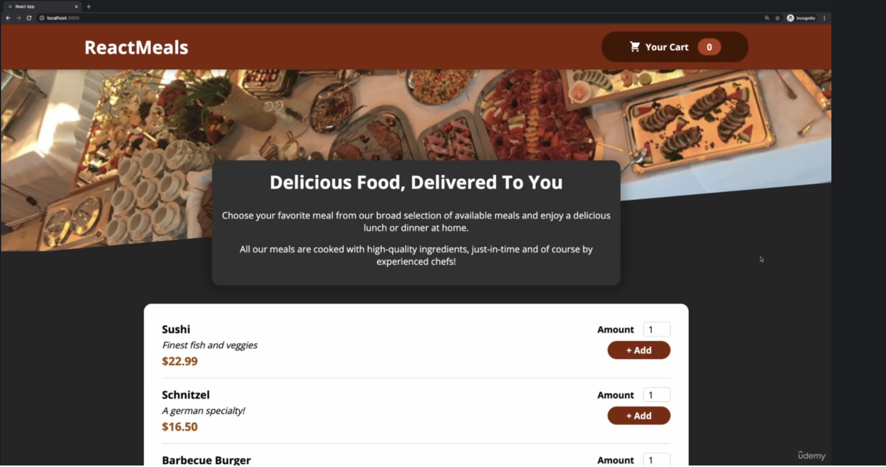
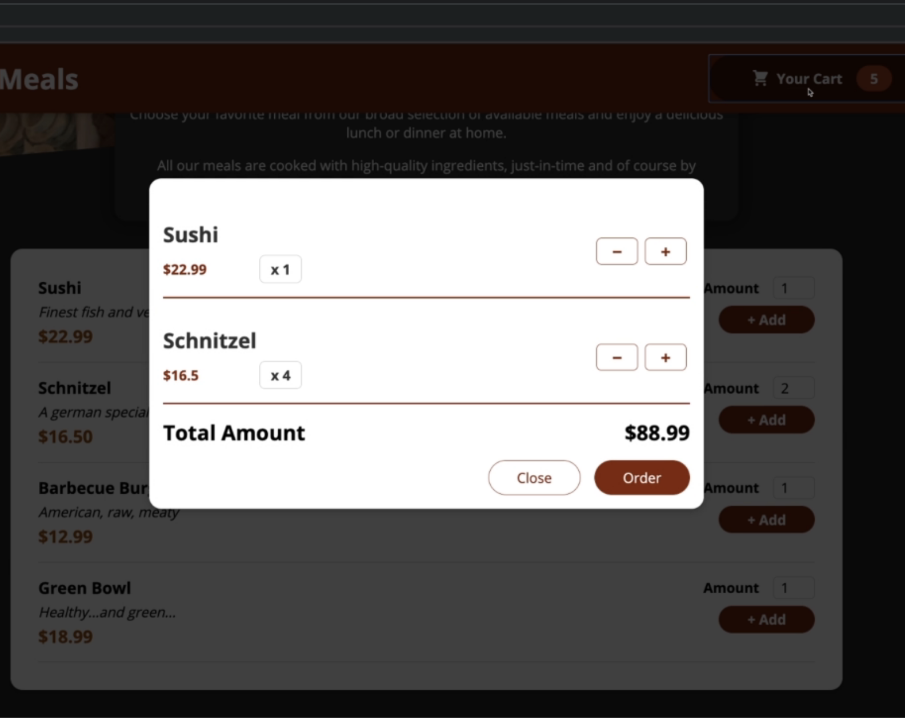

# Mealler
---
React app for take-away ordering.
## UI:
### Main Page:

### Cart:

## Components:
<pre style="background: none">
Header
  CartButton (ModalCtx, OrderCtx)
GreetingCard
Meals (OrderCtx)
  MealItem
    MealDescription
    MealItemControls
Cart (OrderCtx)
  CartItem
    MealDescription
    CartItemControls
  CartFooter
UI
  Button
  Card
  Modal
  Input
</pre>

## State:
ModalContext=> modals: { cart: false }, setModal: () => {}  
OrderContext=>  
&nbsp;&nbsp;positions: {Order},  
&nbsp;&nbsp;totalAmount: number,  
&nbsp;&nbsp;totalPrice: number,  
&nbsp;&nbsp;addOrderPosition: () => {},  
&nbsp;&nbsp;removeOrderPosition: () => {}  

MealItemControls=>  
&nbsp;&nbsp;amount: number
&nbsp;&nbsp;isValid: bool

## Interfaces:
<pre style="background: none">
Meal:
  id: string
  name: string
  description: string
  price: number
OrderedMeal: extends Meal
  ...
  amount: number
Order:
  positions: [OrderedMeal]
</pre>
